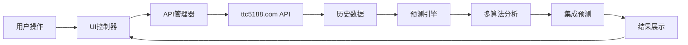
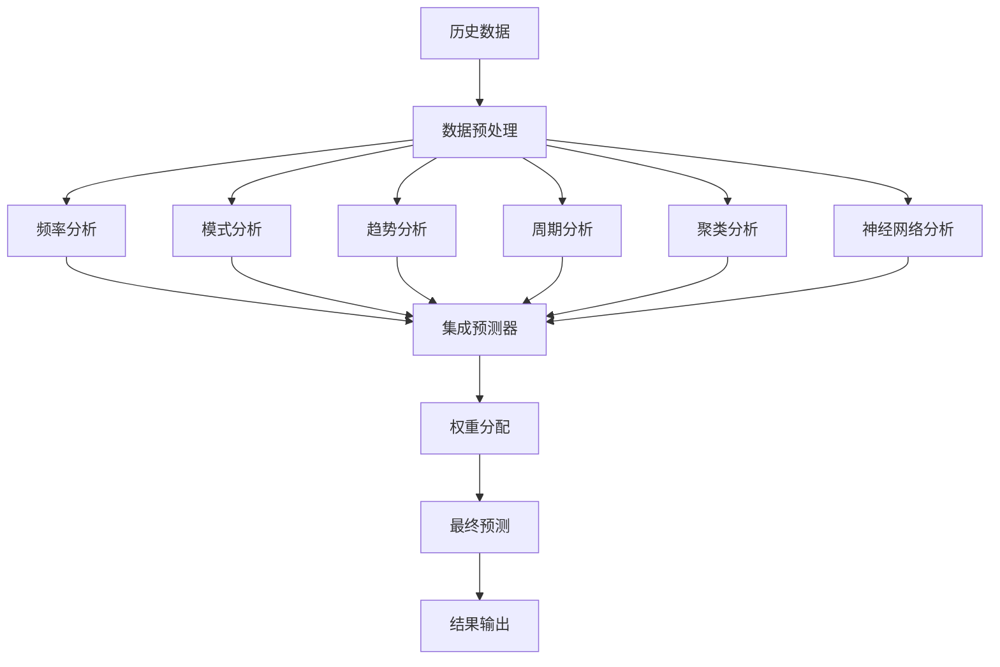

# 新型彩票预测系统 v2.0


## 📖 系统概述

新型彩票预测系统是一个基于现代Web技术构建的智能彩票分析平台，采用多算法融合的预测引擎，提供数据驱动的彩票号码预测服务。

### ✨ 核心特性

- **🌐 实时数据接入**: 基于ttc5188.com API获取最新开奖数据
- **🧠 智能预测引擎**: 集成7种预测算法的综合分析系统
- **📊 数据可视化**: 现代化的响应式界面，支持多设备访问
- **💾 本地缓存**: 智能数据缓存机制，提升响应速度
- **📱 移动友好**: 完全响应式设计，支持移动端和桌面端
- **🔒 隐私保护**: 本地数据处理，保护用户隐私

### 🎯 支持的彩票类型

| 彩票类型 | 代码 | 描述 |
|---------|------|------|
| 🇭🇰 香港六合彩 | `hongkong` | 香港六合彩官方开奖 |
| 🇲🇴 澳门六合彩 | `macaujc` | 澳门六合彩开奖 |
| 🇲🇴 澳门六合彩(二) | `macaujc2` | 澳门六合彩第二套 |
| 🇲🇴 澳门六合彩(三) | `macaujc3` | 澳门六合彩第三套 |
| 🎰 天天彩 | `tianTianCai` | 每日开奖彩票 |

## 🚀 快速开始

### 环境要求

- **浏览器**: Chrome 80+, Firefox 75+, Safari 13+, Edge 80+
- **JavaScript**: ES6+ 支持
- **网络**: 稳定的互联网连接（用于获取API数据）

### 安装部署

#### 方法一：直接部署
```bash
# 1. 下载项目文件
git clone [项目地址]
cd jia-main

# 2. 启动本地服务器
python -m http.server 8000
# 或使用 Node.js
npx http-server -p 8000

# 3. 访问系统
# 浏览器打开: http://localhost:8000/simple-test.html
# 或直接使用预测系统: http://localhost:8000/prediction-system.html
```

#### 方法二：生产部署
```bash
# 1. 配置Web服务器（Nginx示例）
server {
    listen 80;
    server_name your-domain.com;
    root /path/to/jia-main;
    index prediction-system.html;

    location / {
        try_files $uri $uri/ =404;
    }

    # API代理（可选）
    location /api/ {
        proxy_pass https://ttc5188.com/api/;
        proxy_set_header Host ttc5188.com;
    }
}
```

## 📁 项目结构

```
jia-main/
├── css/
│   └── prediction-system.css    # 系统样式文件
├── js/
│   ├── lottery-api.js           # 数据API管理器
│   ├── prediction-engine.js     # 预测算法引擎
│   └── prediction-ui.js         # 用户界面控制器
├── system/
│   └── index.html               # 原始系统页面
├── prediction-system.html       # 新预测系统主页面
├── simple-test.html             # 系统功能测试页面
├── test-system.js               # Node.js测试脚本
├── index.html                   # 站点首页
├── 404.html                     # 404错误页面
└── README.md                    # 项目文档
```

## 🔧 系统架构

### 核心组件

#### 1. 数据管理层 (`lottery-api.js`)
- **LotteryDataAPI**: 统一的API数据管理器
- **功能**: 数据获取、缓存管理、格式转换、错误处理
- **API端点**:
  - `GET /api/current/:lotteryCode` - 获取最新开奖
  - `GET /api/history/:lotteryCode` - 获取历史数据

#### 2. 预测引擎层 (`prediction-engine.js`)
- **AdvancedPredictionEngine**: 主要预测引擎
- **FrequencyAnalyzer**: 频率分析器
- **PatternAnalyzer**: 模式分析器
- **TrendAnalyzer**: 趋势分析器
- **CyclicAnalyzer**: 周期分析器
- **ClusterAnalyzer**: 聚类分析器
- **NeuralPredictor**: 神经网络预测器
- **EnsemblePredictor**: 集成预测器

#### 3. 用户界面层 (`prediction-ui.js`)
- **PredictionSystemUI**: 主要UI控制器
- **功能**: 界面管理、事件处理、数据展示、用户交互

### 数据流程



### 算法架构



## 🎮 使用指南

### 基本操作

1. **启动系统**
   - 打开浏览器访问 `prediction-system.html`
   - 系统会自动初始化并加载默认彩票类型

2. **选择彩票类型**
   - 点击顶部的彩票类型标签
   - 支持的彩票类型会以图标和名称显示
   - 当前选中的彩票类型会高亮显示

3. **查看历史数据**
   - 左侧面板显示最新开奖结果
   - 历史数据列表包含最近20期开奖信息
   - 数据统计区域显示号码频率分析

4. **执行预测分析**
   - 点击右侧的"开始预测"按钮
   - 系统会显示分析进度和各个算法的执行状态
   - 预测完成后显示推荐号码和备选号码

5. **查看预测历史**
   - 右侧底部显示历史预测记录
   - 包含预测时间、号码、置信度等信息
   - 可以跟踪预测的准确率

### 高级功能

#### 数据刷新
- 点击"刷新数据"按钮获取最新开奖信息
- 系统会自动清除缓存并重新获取API数据

#### 缓存管理
- 系统默认缓存5分钟，提升响应速度
- 点击"清除缓存"可以强制刷新所有数据

#### 历史数据加载
- 点击"加载更多"可以获取更多历史数据
- 支持按年份和页数加载历史数据

### 预测结果解读

#### 推荐号码
- **含义**: 基于多算法分析得出的最优预测
- **置信度**: 通常在70-85%之间
- **使用**: 作为主要参考号码

#### 备选号码
- **含义**: 次优预测方案
- **置信度**: 略低于推荐号码
- **使用**: 作为备用方案或组合投注

#### 分析信息
- **数据期数**: 用于分析的历史数据数量
- **算法数量**: 参与预测的算法个数
- **集成分数**: 多算法一致性评分
- **数据质量**: 历史数据的完整性和质量评估

## 🔧 API文档

### LotteryDataAPI 类

#### 构造函数
```javascript
const api = new LotteryDataAPI();
```

#### 方法

##### getCurrentResult(lotteryCode)
获取最新开奖结果
- **参数**: `lotteryCode` - 彩票类型代码
- **返回**: `Promise<Object>` - 最新开奖数据
- **示例**:
```javascript
const result = await api.getCurrentResult('hongkong');
console.log(result.expect);    // 期号
console.log(result.numbers);   // 开奖号码数组
console.log(result.openTime);  // 开奖时间
```

##### getHistoryResult(lotteryCode, options)
获取历史开奖结果
- **参数**:
  - `lotteryCode` - 彩票类型代码
  - `options.year` - 年份（默认当年）
  - `options.page` - 页码（默认1）
  - `options.pageSize` - 每页数量（默认50）
- **返回**: `Promise<Object>` - 历史数据
- **示例**:
```javascript
const history = await api.getHistoryResult('hongkong', {
    year: 2025,
    page: 1,
    pageSize: 20
});
console.log(history.data);      // 历史数据数组
console.log(history.pagination); // 分页信息
```

##### getBatchHistoryData(lotteryCode, years)
批量获取多年历史数据
- **参数**:
  - `lotteryCode` - 彩票类型代码
  - `years` - 获取年数（默认2年）
- **返回**: `Promise<Array>` - 完整历史数据
- **示例**:
```javascript
const batchData = await api.getBatchHistoryData('hongkong', 3);
console.log(`获取到 ${batchData.length} 期数据`);
```

### AdvancedPredictionEngine 类

#### 构造函数
```javascript
const engine = new AdvancedPredictionEngine();
```

#### 方法

##### predict(historyData, options)
执行预测分析
- **参数**:
  - `historyData` - 历史数据数组
  - `options.lotteryType` - 彩票类型（可选）
  - `options.period` - 预测期号（可选）
- **返回**: `Promise<Object>` - 预测结果
- **示例**:
```javascript
const prediction = await engine.predict(historyData, {
    lotteryType: 'hongkong'
});
console.log(prediction.predictions.recommended); // 推荐号码
console.log(prediction.confidence);               // 置信度
console.log(prediction.reasoning);                // 分析 reasoning
```

## 🧪 测试指南

### 自动化测试

1. **基础功能测试**
   - 访问 `simple-test.html`
   - 点击"开始系统检查"按钮
   - 检查所有模块加载状态

2. **API连接测试**
   - 点击"测试API连接"按钮
   - 验证数据获取功能
   - 检查缓存机制

3. **预测引擎测试**
   - 点击"测试预测算法"按钮
   - 验证各算法组件功能
   - 检查预测结果生成

4. **UI界面测试**
   - 点击"测试用户界面"按钮
   - 验证响应式设计
   - 检查交互功能

### 手动测试清单

- [ ] 页面加载正常，无JavaScript错误
- [ ] 所有彩票类型可以正常切换
- [ ] 历史数据正确显示
- [ ] 预测功能可以正常执行
- [ ] 预测结果格式正确
- [ ] 缓存功能工作正常
- [ ] 响应式设计在移动端正常
- [ ] 错误处理机制有效

## 🔒 隐私与安全

### 数据隐私
- 所有预测计算在本地浏览器执行
- 用户数据不会上传到服务器
- 历史预测记录存储在本地LocalStorage

### 安全建议
- 定期清除浏览器缓存
- 使用HTTPS访问生产环境
- 定期更新系统版本
- 避免在公共设备上使用

## 📊 性能优化

### 缓存策略
- **API数据缓存**: 5分钟自动过期
- **预测结果缓存**: 本地存储，手动清理
- **静态资源缓存**: 浏览器标准缓存

### 优化建议
- 使用现代浏览器获得最佳性能
- 定期清除LocalStorage保持性能
- 关闭不必要的浏览器扩展
- 确保网络连接稳定

## 🐛 故障排除

### 常见问题

#### 1. 页面无法加载
**症状**: 页面显示空白或错误
**解决方案**:
- 检查浏览器JavaScript是否启用
- 确认所有文件路径正确
- 检查浏览器控制台错误信息

#### 2. API连接失败
**症状**: 无法获取开奖数据
**解决方案**:
- 检查网络连接状态
- 确认API服务可用性
- 尝试刷新数据或清除缓存

#### 3. 预测功能异常
**症状**: 预测按钮无响应或报错
**解决方案**:
- 确认历史数据充足（至少10期）
- 检查浏览器控制台错误
- 尝试刷新页面重新加载

#### 4. 移动端显示异常
**症状**: 手机上布局错乱
**解决方案**:
- 更新浏览器到最新版本
- 确认viewport设置正确
- 检查CSS文件加载状态

### 调试模式

启用开发者工具进行调试：
1. 按F12打开开发者工具
2. 查看Console面板的错误信息
3. 使用Network面板监控API请求
4. 检查Elements面板的DOM结构

## 📝 更新日志

### v2.0.0 (2025-11-28)
- ✨ 全新的预测系统架构
- 🌐 集成ttc5188.com API数据源
- 🧠 实现7种预测算法融合引擎
- 📨 现代化响应式用户界面
- 💾 智能缓存机制
- 📱 移动端完美适配
- 🔧 完整的测试套件
- 📚 详细的文档和使用指南

### v1.x.x (历史版本)
- 基础AI预测功能
- 简单的数据可视化
- 有限的多彩种支持

## 🤝 贡献指南

### 开发环境设置
```bash
# 克隆项目
git clone [项目地址]
cd jia-main

# 安装开发依赖
npm install

# 启动开发服务器
npm run dev

# 运行测试
npm test

# 构建生产版本
npm run build
```

### 代码规范
- 使用ES6+语法
- 遵循JavaScript Standard Style
- 编写清晰的注释
- 保持代码简洁和可维护性

### 提交流程
1. Fork项目仓库
2. 创建功能分支
3. 提交代码更改
4. 创建Pull Request
5. 等待代码审查

## 📄 许可证

本项目采用 MIT 许可证 - 查看 [LICENSE](LICENSE) 文件了解详情。

## 📞 联系方式

- **项目维护者**: [您的姓名]
- **邮箱**: [您的邮箱]
- **问题反馈**: [GitHub Issues链接]
- **功能建议**: [功能请求链接]

---

## ⚠️ 免责声明

**重要提示**: 本系统仅供学习和娱乐参考使用，不构成任何投注建议。彩票具有随机性质，任何预测结果都不能保证准确性。请理性购彩，量力而行，切勿沉迷。

**风险提示**:
- 彩票具有不可预测的随机性
- 历史数据不能保证未来结果
- 本系统预测结果仅供参考
- 投注有风险，请谨慎决策

---

*最后更新: 2025年11月28日*