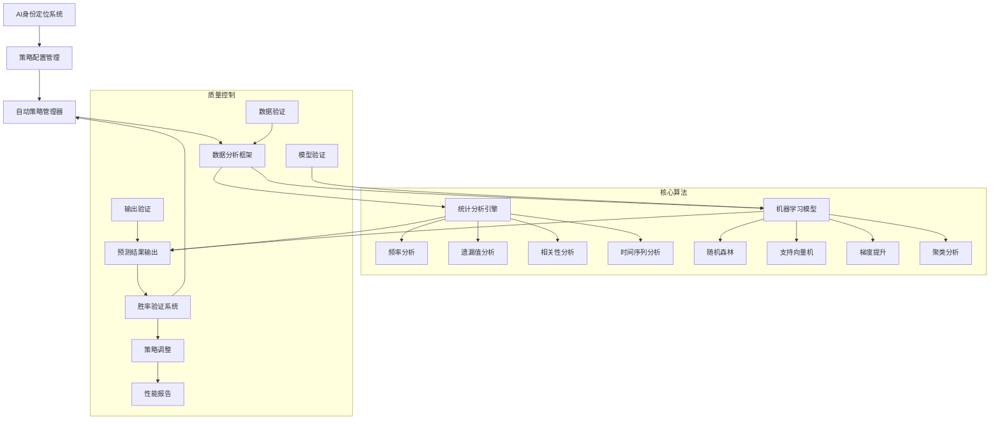

# AI严谨预测系统实施计划

> **目标**: 构建基于统计分析的严谨AI预测系统，实现胜率验证和自动策略切换
> **更新时间**: 2025-11-13

---

## 系统概览

本系统采用多算法融合的方式，通过严格的统计分析和机器学习模型进行预测，并内置胜率验证机制，当胜率低于40%时自动切换策略组合。

### 核心组件
1. **AI身份定位系统** - 确保AI以专业数据分析师身份工作
2. **算法策略配置** - 定义多种预测算法及其权重
3. **自动策略管理器** - 实现胜率验证和自动切换
4. **数据分析框架** - 提供历史分析和模型训练能力

---

## Stage 1: 系统基础架构
**目标**: 建立完整的技术框架和身份定位
**Success Criteria**:
- [x] AI身份定位提示词模板完成
- [x] 策略配置文件创建
- [x] 核心算法框架搭建
**Tests**: 文件完整性检查，配置格式验证
**Status**: ✅ Complete

**完成文件**:
- [AI_PERSONA.md](AI_PERSONA.md) - 完整的AI身份定位和分析师规范
- [STRATEGY_CONFIG.json](STRATEGY_CONFIG.json) - 算法策略组合配置

---

## Stage 2: 自动策略管理系统
**目标**: 实现预测胜率验证和策略自动切换机制
**Success Criteria**:
- [x] 策略性能追踪系统
- [x] 胜率低于40%的自动检测
- [x] 策略权重动态调整
- [x] 数据库存储和查询
**Tests**: 胜率阈值测试，策略切换验证
**Status**: ✅ Complete

**完成文件**:
- [auto_strategy_manager.py](auto_strategy_manager.py) - 完整的策略管理系统

---

## Stage 3: 数据分析和模型训练
**目标**: 构建历史数据分析框架和机器学习模型
**Success Criteria**:
- [x] 统计分析算法实现
- [x] 机器学习模型训练
- [x] 特征工程和数据预处理
- [x] 集成预测系统
**Tests**: 模型准确性验证，交叉验证测试
**Status**: ✅ Complete

**完成文件**:
- [data_analytics_framework.py](data_analytics_framework.py) - 综合数据分析框架

---

## Stage 4: 系统集成和部署
**目标**: 整合所有组件，构建完整的工作流程
**Success Criteria**:
- [ ] 统一的预测接口
- [ ] 自动化工作流
- [ ] 实时监控和报警
- [ ] 用户友好的输出格式
**Tests**: 端到端集成测试，性能基准测试
**Status**: Not Started

**待实现组件**:
- 主控制器 (main_controller.py)
- API接口层 (api_layer.py)
- 监控仪表板 (monitoring_dashboard.py)
- 配置管理器 (config_manager.py)

---

## Stage 5: 优化和扩展
**目标**: 系统性能优化和功能扩展
**Success Criteria**:
- [ ] 深度学习模型集成
- [ ] 实时数据流处理
- [ ] 高级可视化功能
- [ ] 移动端接口支持
**Tests**: 压力测试，扩展性验证
**Status**: Not Started

---

## 技术架构



## 算法策略详细说明

### 1. 频率分析策略 (权重: 25%)
- **描述**: 基于历史号码出现频率进行预测
- **核心算法**: 描述性统计、卡方检验、趋势分析
- **优势**: 简单直观，适合短期预测
- **风险**: 在随机性强的环境下效果有限

### 2. 时间序列策略 (权重: 20%)
- **描述**: 分析号码序列的时间特征
- **核心算法**: ARIMA模型、季节性分解、傅里叶分析
- **优势**: 能捕捉周期性规律
- **风险**: 需要足够的历史数据

### 3. 模式识别策略 (权重: 20%)
- **描述**: 使用机器学习识别复杂模式
- **核心算法**: K-means聚类、神经网络、异常检测
- **优势**: 能发现非线性关系
- **风险**: 容易过拟合

### 4. 概率模型策略 (权重: 20%)
- **描述**: 基于概率论和贝叶斯方法
- **核心算法**: 贝叶斯推断、马尔可夫链、蒙特卡洛模拟
- **优势**: 提供概率解释
- **风险**: 依赖于先验假设

### 5. 集成学习策略 (权重: 15%)
- **描述**: 融合多个模型的预测结果
- **核心算法**: 随机森林、XGBoost、投票集成
- **优势**: 提高预测稳定性
- **风险**: 计算复杂度较高

## 质量保证机制

### 1. 数据质量检查
- 数据完整性验证
- 异常值检测和处理
- 数据一致性检查

### 2. 模型性能监控
- 实时准确率跟踪
- 交叉验证结果
- 过拟合检测

### 3. 预测结果验证
- 概率归一化检查
- 置信度评估
- 不确定性量化

### 4. 自动调整机制
- 胜率低于40%自动警告
- 连续失败策略降权
- 动态权重重新分配

## 使用指南

### 快速开始
```bash
# 1. 安装依赖
pip install pandas numpy scikit-learn tensorflow matplotlib seaborn

# 2. 准备历史数据 (CSV格式)
# 格式: period, draw_date, num_1, num_2, num_3, num_4, num_5

# 3. 运行预测系统
python data_analytics_framework.py
```

### 配置说明
- **AI_PERSONA.md**: AI身份和行为规范
- **STRATEGY_CONFIG.json**: 算法策略和权重配置
- 数据库: SQLite自动创建，存储预测记录和性能指标

### API使用示例
```python
from auto_strategy_manager import AdaptiveStrategyManager
from data_analytics_framework import IntegratedPredictionSystem

# 创建系统实例
system = IntegratedPredictionSystem()
manager = AdaptiveStrategyManager()

# 加载数据并分析
data = system.load_historical_data("historical_data.csv")
analysis = system.run_comprehensive_analysis()

# 训练模型并预测
system.train_models()
predictions = system.generate_predictions()

# 验证预测结果
from auto_strategy_manager import PredictionResult
result = PredictionResult(
    strategy_name="集成预测",
    prediction_date=datetime.now(),
    predicted_numbers=predictions['ensemble_prediction'],
    actual_numbers=actual_draw_numbers,
    probability_score=predictions['confidence_scores']['ensemble'],
    confidence_interval=(0.6, 0.8)
)
manager.record_prediction(result)
```

## 风险提示和免责声明

⚠️ **重要提醒**:
1. 本系统仅用于统计分析和教育目的
2. 预测结果仅供参考，不保证准确性
3. 请勿用于实际投注或相关活动
4. 所有预测都基于历史数据的统计模式
5. 随机事件的本质决定了预测的局限性

## 系统维护和更新

- **定期更新**: 建议每周更新历史数据
- **模型重训练**: 每月重新训练机器学习模型
- **性能评估**: 每季度评估整体系统性能
- **策略优化**: 根据实际表现调整算法权重

---

**联系支持**: 如有问题或建议，请通过系统日志反馈或联系开发团队。
**版本信息**: v1.0.0 (2025-11-13)